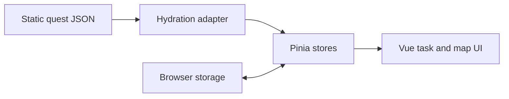

# Architecture

TarkovTracker is a static Nuxt 4 SPA. It renders task progress and interactive maps from exporter
JSON and saves local preferences and progress in browser storage.

## Runtime

The app has no backend runtime. `NUXT_PUBLIC_STATIC_QUEST_DATA_BASE_URL` selects the static JSON
base, with `/quest-data` as the default. `APP_URL` supplies the public canonical URL when deployed.

## Module boundaries

- `app/pages/` contains the SPA routes.
- `app/features/tasks/` and `app/features/maps/` own task presentation and map interactions.
- `app/stores/` holds metadata, preferences, and local progress.
- `app/utils/staticQuestHydration.ts` is the sole exporter-document adapter.
- `public/quest-data/` provides development fixtures.
