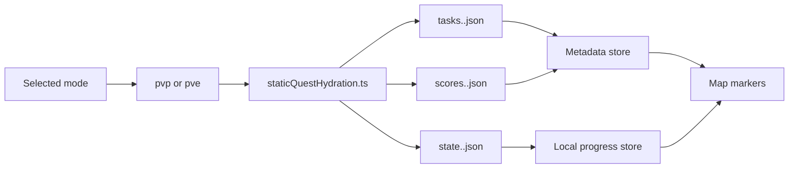

# Static viewer systems

## Static quest hydration

The SPA loads `tasks|state|scores.<file-mode>.json` from
`NUXT_PUBLIC_STATIC_QUEST_DATA_BASE_URL`, which defaults to `/quest-data`. The exporter file modes
are `pvp` and reserved `pve`; internal Seasonal uses `pvp` data.

`app/utils/staticQuestHydration.ts` fetches and validates all three documents concurrently, then
applies the bundle through `app/stores/tarkov/staticQuestStoreBridge.ts`. The metadata plugin starts
the initial load. Progress is kept in browser storage. The map page separately loads the optional
`quest_summaries.jsonl` document from the same base URL. It uses summaries and bring-item lists when
present, while quests missing from that document fall back to their task title and objectives.

### Invariants

- Every document in a bundle declares schema version 1 and the resolved file mode; a malformed or
  mixed bundle applies nothing.
- `state.<file-mode>.json` alone determines confirmed and active task progress. Catalog-only tasks
  never become available or create markers.
- Scores contain every non-excluded catalog map, preserve descending relevance order and relative
  numeric values, and retain recommendation flags and zone geometry. Maps without active required
  quest objectives remain present with an empty quest list and a score of zero.
- A generation fence prevents an earlier, slower mode load from overwriting the current selection.
- PvP and Seasonal request the `pvp` documents; PvE requests the `pve` documents.
- A missing or malformed quest summary document never blocks map rendering or quest fallbacks.
- The running viewer has no server API, authentication, synchronization, database, worker, or
  precomputation path.
